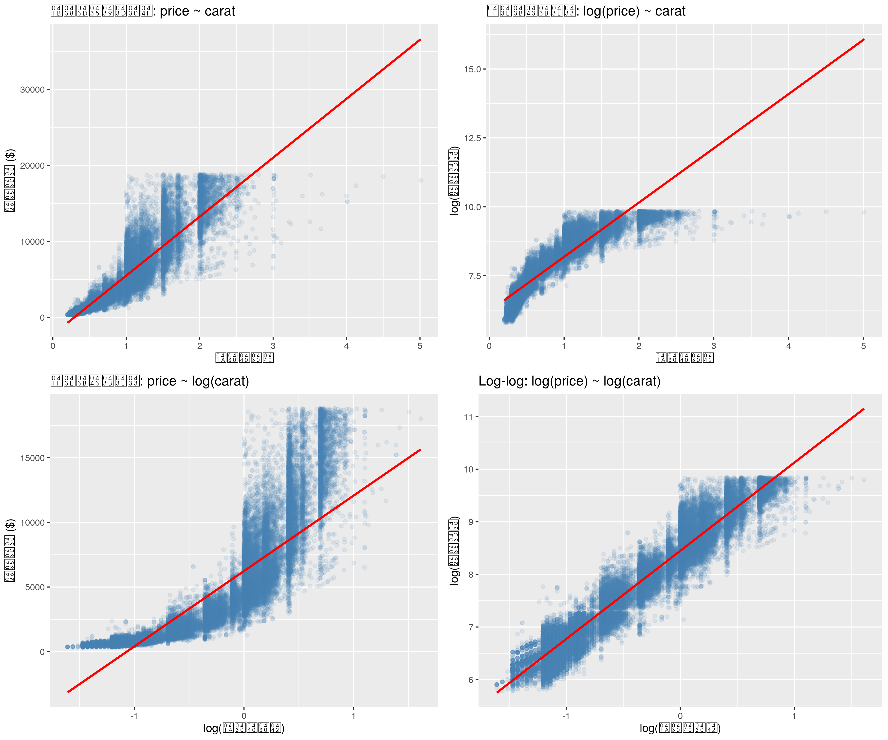
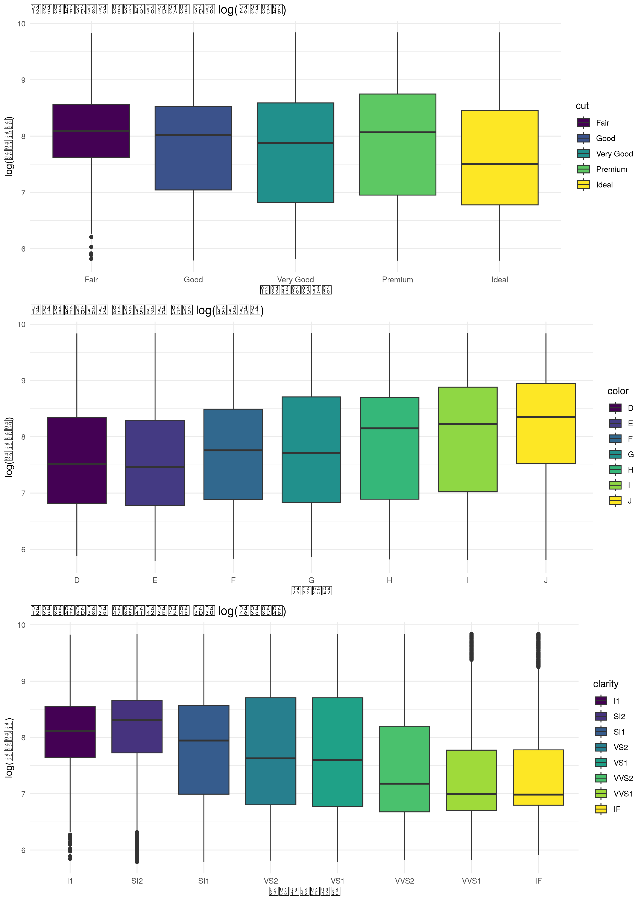
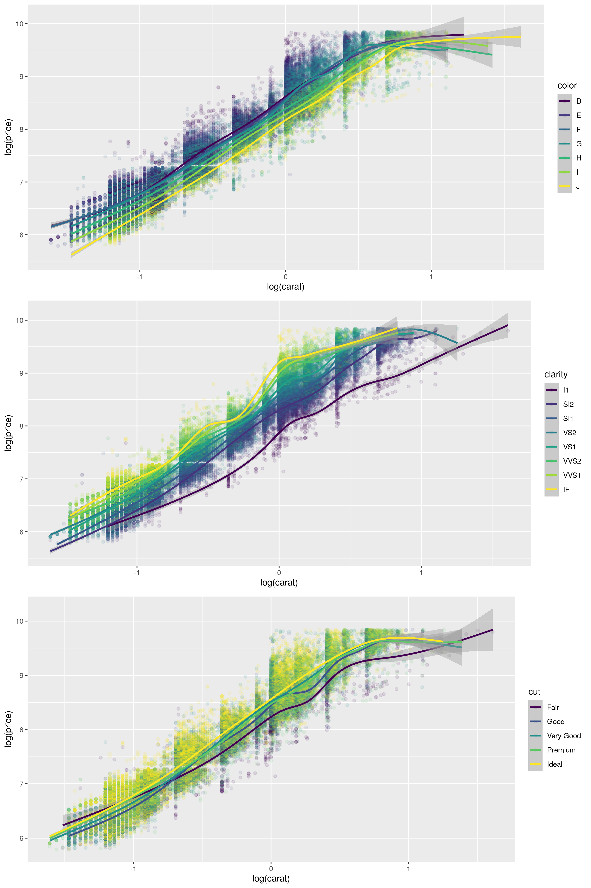
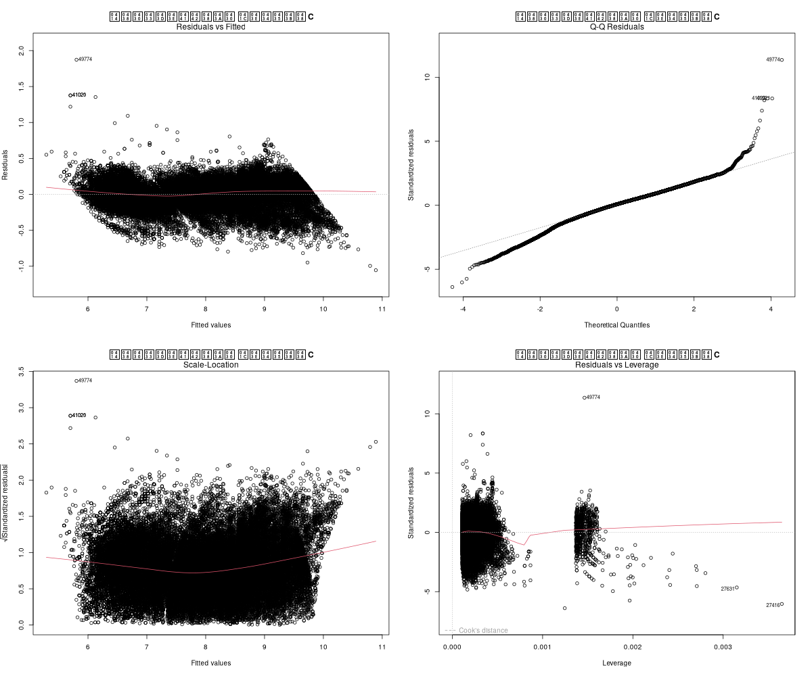
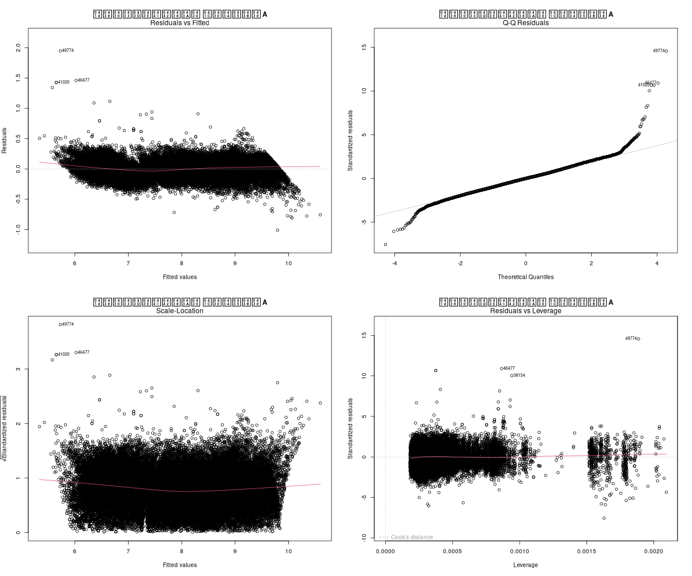

# Лабораторная работа №3 — Построение правильно специфицированной регрессии

Датасет: `diamonds` (ggplot2). 53 940 наблюдений о бриллиантах (цена, карат, огранка, цвет, чистота и геометрические параметры).

---

## Консольный вывод

При запуске скрипт последовательно выводит:

1. **Сообщения о подключении пакетов** — стандартные предупреждения R при загрузке `memisc`, `lmtest`, `ggplot2`, `dplyr` и др. о перекрытии функций.

2. **Первичный обзор данных** (`summary`) — диапазоны, медианы и квартили по всем переменным датасета.

3. **Матрица корреляций числовых переменных** — `carat`, `x`, `y`, `z` сильно коррелируют с `price` (≈ 0.92); `depth` и `table` имеют слабую корреляцию.

4. **Промежуточные таблицы `mtable`** — пошаговый отбор значимых дамми-переменных отдельно по каждой группе (цвет, чистота, огранка); сравниваются полная и сокращённая версии каждой группы.

5. **Сводки трёх финальных моделей** (`summary`):
   - **Модель A** — полная log-log с factor-переменными; R² adj = **0.9826**
   - **Модель B** — сокращённая log-log с отобранными дамми; R² adj = **0.9735**
   - **Модель C** — расширение B квадратичным членом `I(log(carat)²)`; R² adj = **0.9735**

6. **Сводная таблица `mtable(A, B, C)`** — коэффициенты, стандартные ошибки и R² всех трёх моделей в одной таблице.

7. **Информационные критерии**:
   - AIC: A = −63893, B = −41223, C = −41229
   - BIC: A = −63715, B = −41107, C = −41105
   - Модель A выигрывает по AIC/BIC за счёт более полной спецификации категорий.

8. **Вложенный F-тест (B против C)** — F = 8.47, p = 0.0036: квадратичный член статистически значимо улучшает модель B.

9. **Тест Рамсея (RESET)** — для всех трёх моделей p < 2.2e-16: функциональная форма не является полностью правильной, присутствуют неучтённые нелинейности.

10. **Тест Брейша–Пагана** — для всех моделей p < 2.2e-16: гетероскедастичность остатков подтверждена.

11. **Итоговый вывод** — текстовая интерпретация с рекомендацией: при значимых RESET- и F-тестах Модель C является наиболее правильно специфицированной из рассмотренных.

---

## Графический вывод

Все графики сохраняются в директорию `output/`.

### 01 — Функциональные формы

Сетка 2×2 из графиков рассеяния `price ~ carat` в четырёх функциональных формах: линейная, две полулогарифмических и log-log. Log-log форма (нижний правый панель) даёт наиболее равномерное облако точек вокруг линии регрессии — подтверждает степенной характер зависимости.

### 02 — Влияние категорий

Три вертикально расположенных boxplot: влияние **огранки** (cut), **цвета** (color) и **чистоты** (clarity) на `log(price)`. Показывает медианы и разброс цен по категориям — чем ниже качество, тем в целом ниже медиана цены, хотя из-за связи с размером камня есть исключения.

### 03 — Log-log по категориям

Три графика рассеяния `log(price) ~ log(carat)` с кривыми сглаживания, раскрашенными по **цвету**, **чистоте** и **огранке** соответственно. Кривые для разных категорий идут приблизительно параллельно — обосновывает аддитивную модель с дамми-переменными.

### 04 — Диагностика Модели C

Четыре стандартных диагностических графика для **Модели C**: Residuals vs Fitted, Normal Q-Q, Scale-Location, Residuals vs Leverage. Остатки не вполне случайны: заметна гетероскедастичность (воронкообразный паттерн) и отклонения от нормальности на хвостах Q-Q — согласуется с результатами статистических тестов.

### 05 — Диагностика Модели A

Аналогичные четыре диагностических графика для **Модели A**. Картина схожа с Моделью C: гетероскедастичность и тяжёлые хвосты остатков присутствуют, несмотря на более высокий R².

---

## Теоретические сведения по лабораторной работе

### 1. Правильно специфицированная регрессия

Правильно специфицированной называется такая регрессионная модель, в которой:

- выбрана адекватная **функциональная форма** связи между зависимой и объясняющими переменными;
- включены **существенные факторы**, влияющие на результат;
- исключены явно **лишние регрессоры**, не улучшающие интерпретацию и качество модели;
- корректно учтена природа переменных: количественные факторы вводятся как числовые, а качественные — через **фиктивные (dummy) переменные**;
- остатки модели не демонстрируют систематического поведения, которое указывало бы на пропущенную нелинейность или ошибку структуры.

Ошибка спецификации приводит к смещённым выводам: коэффициенты могут неверно отражать силу и направление связи, статистические тесты — давать некорректные результаты, а прогнозы — ухудшаться.

### 2. Выбор функциональной формы

Для эконометрических и прикладных задач одна и та же зависимость может быть описана по-разному. Наиболее распространённые формы:

- **линейная**: `y = β0 + β1x + u`;
- **полулогарифмическая**: `log(y) = β0 + β1x + u` или `y = β0 + β1log(x) + u`;
- **логарифмическая (log-log)**: `log(y) = β0 + β1log(x) + u`.

Логарифмирование часто применяют, когда:

- разброс значений очень велик;
- связь между переменными носит **нелинейный, но монотонный** характер;
- важна интерпретация коэффициентов через **эластичности**.

В log-log модели коэффициент `β1` показывает, на сколько процентов в среднем изменится `y` при увеличении `x` на 1%. Для данных о цене и массе бриллианта такая интерпретация особенно удобна, поскольку зависимость обычно является степенной, а не строго линейной.

### 3. Роль визуального анализа

Перед построением модели выполняется графический анализ данных. Он позволяет:

- выявить форму зависимости между `price` и количественными признаками;
- понять, есть ли выбросы и сильная асимметрия распределений;
- оценить, различаются ли уровни зависимой переменной между категориями `cut`, `color`, `clarity`;
- заметить возможную неоднородность дисперсии остатков ещё до формального тестирования.

Графики рассеяния, boxplot и сглаживающие кривые являются первым этапом проверки гипотезы о корректной спецификации модели.

### 4. Количественные и качественные регрессоры

В задаче по бриллиантам используются два типа объясняющих переменных:

- **количественные** — например, `carat`, `x`, `y`, `z`, `depth`, `table`;
- **качественные** — например, `cut`, `color`, `clarity`.

Качественные признаки нельзя напрямую включать в регрессию как числа без потери смысла. Поэтому они кодируются системой dummy-переменных. Если признак имеет `k` категорий, в модель обычно включают `k-1` фиктивных переменных, а одна категория становится **базовой**. Коэффициенты при dummy-переменных показывают отличие соответствующей категории от базовой при прочих равных условиях.

### 5. Полная и сокращённая модель

Логика лабораторной работы состоит в последовательном переходе:

1. от **полной модели**, включающей все содержательно важные факторы;
2. к **сокращённой модели**, где удаляются статистически и содержательно слабые регрессоры;
3. к **уточнённой модели**, в которую при необходимости добавляются нелинейные члены, например квадрат логарифма переменной.

Полная модель полезна как стартовая спецификация, но она не всегда оптимальна: избыточное число переменных может ухудшать интерпретацию, повышать мультиколлинеарность и делать модель менее компактной.

### 6. Квадратичность и нелинейность

Даже если после логарифмирования связь становится ближе к линейной, это не гарантирует полного устранения нелинейности. Поэтому в модель нередко добавляют квадрат объясняющей переменной, например `I(log(carat)^2)`. Такой член позволяет учесть кривизну зависимости и проверить, не меняется ли предельный эффект размера камня при росте его массы.

Если коэффициент при квадратичном члене значим, это означает, что простая линейная зависимость в логарифмах недостаточна и модель требует более гибкой формы.

### 7. Сравнение моделей

Для сопоставления нескольких спецификаций используются следующие критерии:

- **Adjusted R²** — показывает долю объяснённой вариации с поправкой на число регрессоров;
- **AIC** и **BIC** — информационные критерии, балансирующие качество подгонки и сложность модели;
- **вложенный F-тест** — применяется, когда одна модель является частным случаем другой;
- содержательная интерпретируемость коэффициентов и логическая согласованность результатов.

Нельзя выбирать модель только по максимальному `R²`. Более сложная модель почти всегда объясняет данные лучше механически, но это не означает, что она лучше специфицирована. Поэтому необходим комплексный анализ статистических и содержательных критериев.

### 8. Тест Рамсея RESET

**RESET-тест** проверяет, не пропущены ли в модели нелинейные преобразования или важные переменные. Его идея состоит в добавлении в регрессию степеней предсказанных значений и проверке их совместной значимости.

- Нулевая гипотеза: модель специфицирована корректно.
- Альтернативная гипотеза: присутствует ошибка спецификации.

Если `p-value` мало, нулевая гипотеза отвергается, и это означает, что модель, вероятно, не учитывает часть структуры зависимости. В контексте данной лабораторной работы RESET важен для проверки того, насколько выбранная функциональная форма действительно адекватна.

### 9. Тест Брейша–Пагана

**Тест Брейша–Пагана** используется для диагностики **гетероскедастичности**, то есть ситуации, когда дисперсия ошибок непостоянна и меняется от наблюдения к наблюдению.

- Нулевая гипотеза: дисперсия остатков постоянна.
- Альтернативная гипотеза: дисперсия зависит от факторов модели.

Гетероскедастичность не обязательно делает оценки коэффициентов смещёнными, но приводит к некорректным стандартным ошибкам, а значит, t-тесты и доверительные интервалы могут стать ненадёжными. В практическом анализе это означает необходимость осторожной интерпретации статистической значимости.

### 10. Диагностика остатков

После оценки модели анализируют остатки. Основные диагностические графики позволяют проверить:

- есть ли систематический рисунок на графике **Residuals vs Fitted**;
- насколько остатки близки к нормальному распределению по **Q-Q plot**;
- наблюдается ли увеличение разброса ошибок при росте предсказанных значений на **Scale-Location**;
- есть ли наблюдения с высоким рычагом и сильным влиянием на модель по **Residuals vs Leverage**.

Если остатки ведут себя неслучайно, это сигнал о том, что модель можно улучшить: изменить форму зависимости, добавить переменные, преобразовать данные или использовать робастные методы оценки.

### 11. Экономический смысл модели для `diamonds`

В задаче о бриллиантах цена формируется под влиянием как физических характеристик камня, так и его качественных свойств. Наиболее важные идеи интерпретации таковы:

- масса (`carat`) обычно является главным фактором цены;
- влияние размера нелинейно: крупные камни дорожают быстрее, чем пропорционально увеличению массы;
- характеристики качества (`cut`, `color`, `clarity`) сдвигают цену вверх или вниз относительно базовой категории;
- часть геометрических переменных может оказаться избыточной из-за сильной корреляции между собой.

Поэтому задача лабораторной работы — не просто построить регрессию, а получить такую модель, которая одновременно:

- хорошо объясняет данные;
- сохраняет экономический смысл коэффициентов;
- проходит сравнительную диагностику лучше альтернативных спецификаций.

### 12. Итоговая теоретическая идея работы

Лабораторная работа демонстрирует полный цикл эконометрического моделирования:

1. изучение данных и визуальный анализ;
2. выбор функциональной формы;
3. построение альтернативных спецификаций;
4. отбор значимых факторов;
5. проверка нелинейности;
6. сравнение моделей по статистическим критериям;
7. диагностика ошибок спецификации и гетероскедастичности;
8. выбор наиболее обоснованной модели.

Таким образом, основная теоретическая цель работы состоит в том, чтобы научиться отличать просто «хорошо подогнанную» регрессию от **правильно специфицированной** модели, которая даёт более надёжные выводы и интерпретации.
