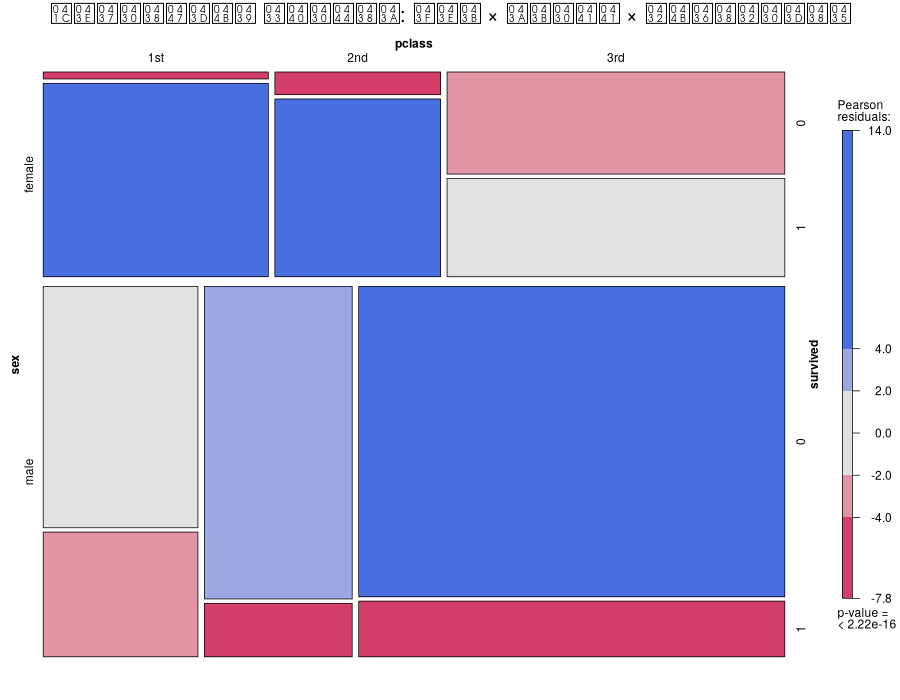
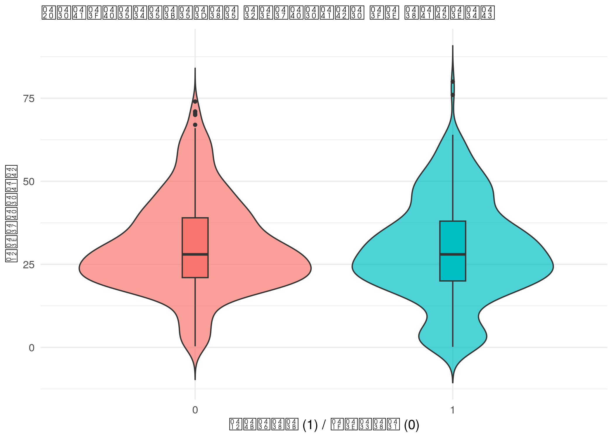
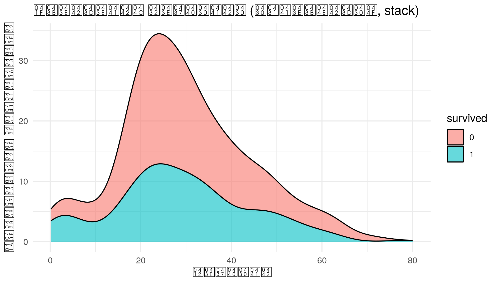
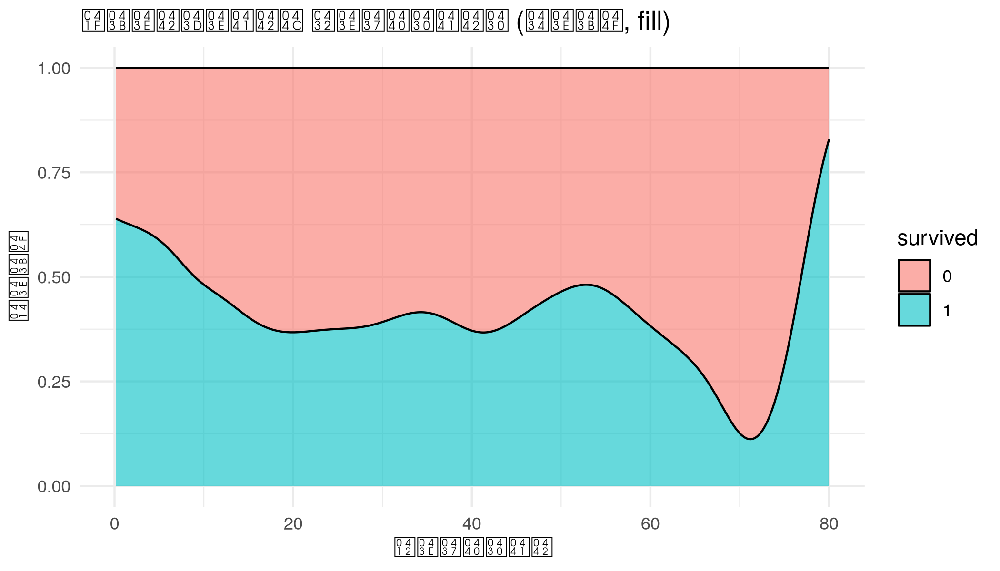
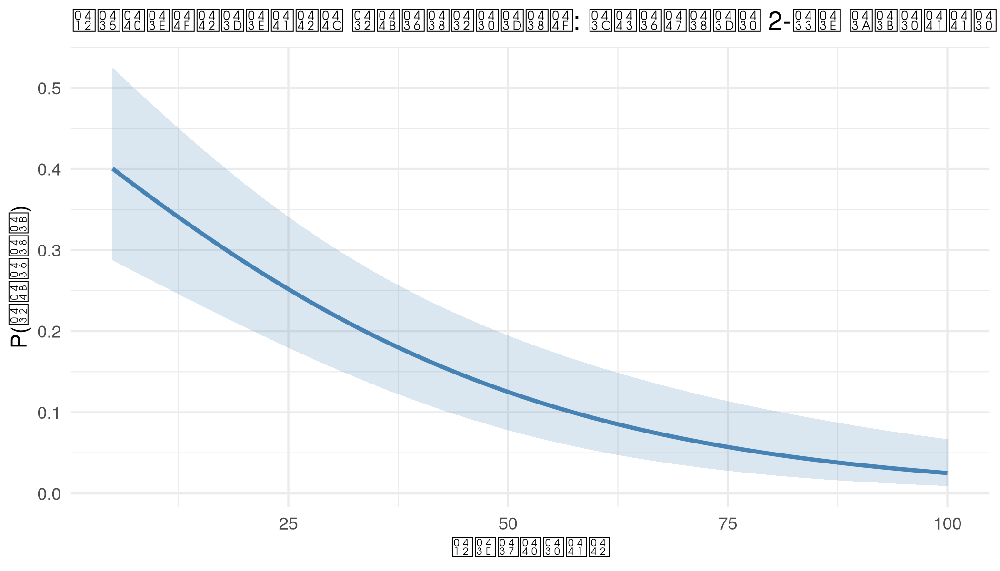
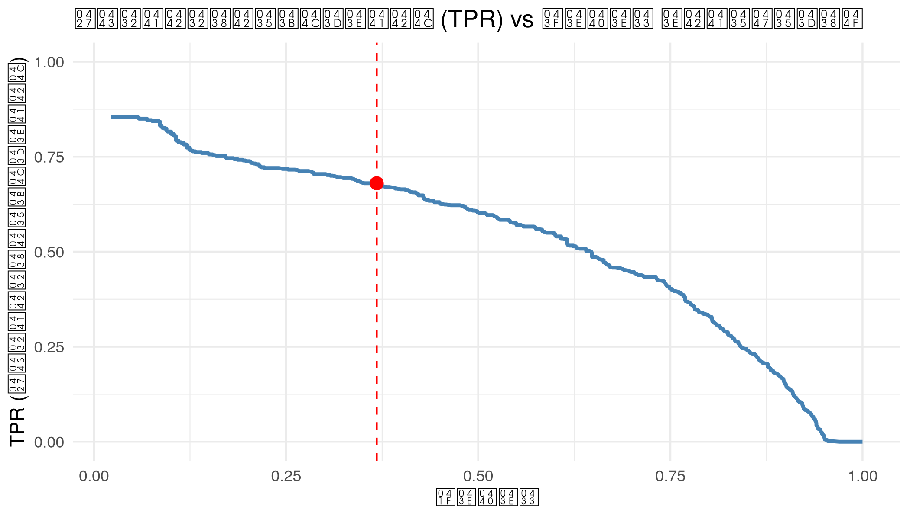
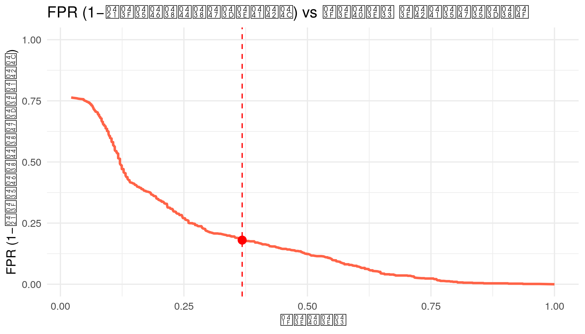
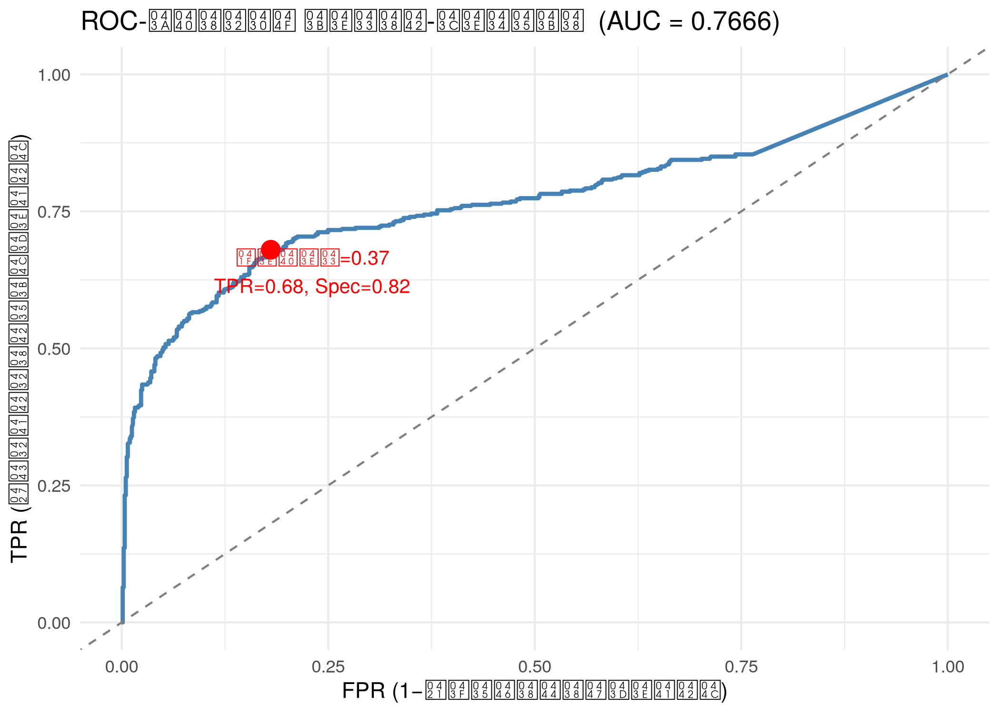
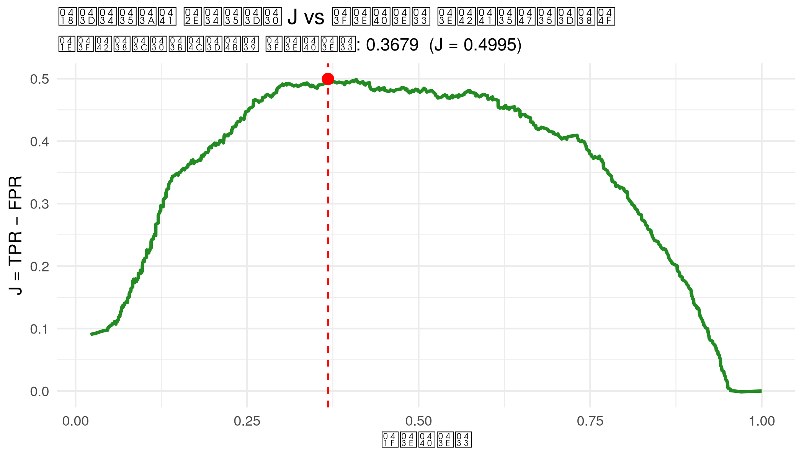

# Лабораторная работа 5 — Логит-модель: выживаемость на Титанике

## Запуск

```bash
make l5-build   # первый запуск / после изменения скрипта
make l5         # повторный запуск (без пересборки образа)
```

---

## Консольный вывод

Скрипт последовательно выводит:

1. **Первичный осмотр данных** — структура датасета (`glimpse`) и сводная статистика (`summary`): 1 309 пассажиров, 15 переменных.

2. **Оценка логит- и пробит-моделей** — таблицы коэффициентов с z-статистиками и p-значениями. Значимые предикторы: пол, возраст и класс каюты; тариф (fare) статистически незначим. AIC логит-модели — **994.35**, пробит — 996.45.

3. **Ковариационная матрица** коэффициентов логит-модели.

4. **Прогнозы** вероятности выживания для синтетического набора данных (мужчины 2-го класса, fare = 100, возраст 5–100 лет) — таблица с линейным предиктором, стандартными ошибками и вероятностями с границами доверительного интервала.

5. **LR-тест** — проверка совместной значимости `pclass` и `fare`. Статистика χ² = 118.58, p < 2.2e-16: добавление класса и тарифа достоверно улучшает модель.

6. **Предельные эффекты** — как изменяется вероятность выживания при единичном изменении каждого предиктора (в средних значениях и усреднённые по выборке).

7. **МНК-модель** (линейная вероятностная модель) для сравнения: R² = 0.37.

8. **ROC-анализ и выбор оптимального порога** по индексу Юдена (J = TPR − FPR):

   | Метрика | Значение |
   |---------|---------|
   | AUC | **0.7666** |
   | Оптимальный порог | **0.3679** |
   | Чувствительность | **0.6800** |
   | Специфичность | **0.8195** |
   | Индекс Юдена J | **0.4995** |
   | Точность (Accuracy) | **0.7770** |

9. **Матрица ошибок** при оптимальном пороге: из 1 045 пассажиров с известным возрастом модель верно классифицирует 77.7%.

---

## Графический вывод

Все 9 графиков сохраняются в директорию `output/`.

### 01 — Мозаичный график: пол, класс и выживаемость



Совместное распределение пола, класса и выживаемости. Наглядно показывает, что женщины 1-го и 2-го класса выживали значительно чаще.

### 02 — Скрипичный график: возраст и выживаемость



Скрипичный график с боксплотом: распределение возраста у выживших и погибших практически одинаково, возраст — слабый предиктор сам по себе.

### 03 — Плотность возраста (stack)



Функции плотности возраста (абсолютные числа, stack): общее число пассажиров по возрасту с разбивкой на выживших и погибших.

### 04 — Плотность возраста (fill)



Функции плотности возраста (доли, fill): доля выживших немного выше у детей.

### 05 — Прогноз вероятности выживания



Кривая прогнозируемой вероятности выживания (с доверительным интервалом) для мужчины 2-го класса в зависимости от возраста — вероятность монотонно снижается с возрастом.

### 06 — ROC: TPR vs порог



Чувствительность (TPR) vs порог: при снижении порога чувствительность растёт. Вертикальная линия — оптимальный порог.

### 07 — ROC: FPR vs порог



Доля ложноположительных (FPR) vs порог: при снижении порога FPR растёт.

### 08 — ROC-кривая



ROC-кривая (FPR vs TPR) с диагональю случайного классификатора, AUC = 0.7666, и отмеченной оптимальной точкой.

### 09 — Индекс Юдена



Индекс Юдена J vs порог: явный максимум в точке порога 0.37 соответствует наилучшему балансу чувствительности и специфичности.

---

## Теоретические сведения

### 1. Логит-модель для бинарного отклика

Если зависимая переменная принимает только два значения (например, пассажир **выжил / не выжил**), линейная регрессия неудобна, потому что её прогнозы могут выходить за пределы интервала [0, 1]. Поэтому используется **логистическая регрессия**, которая моделирует не сам бинарный исход, а вероятность наступления события:

\[
P(Y=1 \mid X)=\pi(X)=\frac{1}{1+e^{-z}}, \qquad z=\beta_0+\beta_1 x_1+\dots+\beta_k x_k.
\]

Здесь:

- \(Y=1\) — событие «пассажир выжил»;
- \(\pi(X)\) — условная вероятность выживания;
- \(x_1, \dots, x_k\) — объясняющие переменные;
- \(\beta_0, \beta_1, \dots, \beta_k\) — параметры модели.

Логистическая функция переводит любое значение линейного индекса \(z\) в интервал от 0 до 1, поэтому модель естественно интерпретируется как модель вероятности.

### 2. Логарифм отношения шансов

В логит-модели линейно описывается не сама вероятность, а **логарифм отношения шансов**:

\[
\log\left(\frac{\pi(X)}{1-\pi(X)}\right)=\beta_0+\beta_1 x_1+\dots+\beta_k x_k.
\]

Отношение

\[
\frac{\pi(X)}{1-\pi(X)}
\]

называется **шансами** (*odds*). Если вероятность выживания равна 0.8, то шансы составляют 0.8 / 0.2 = 4, то есть событие в 4 раза вероятнее, чем его отсутствие.

Коэффициент \(\beta_j\) показывает, как при изменении признака \(x_j\) меняется логарифм шансов выживания. Экспонента коэффициента, \(e^{\beta_j}\), интерпретируется как **мультипликативное изменение шансов**.

### 3. Оценивание параметров

Параметры логистической регрессии оцениваются методом **максимального правдоподобия**. Для каждого наблюдения вероятность получить фактический исход записывается как:

\[
L_i = \pi_i^{y_i}(1-\pi_i)^{1-y_i},
\]

а функция правдоподобия по всей выборке равна произведению этих вероятностей. На практике максимизируют логарифм правдоподобия, что удобнее вычислительно.

В отличие от МНК, здесь нет замкнутой аналитической формулы для оценок коэффициентов, поэтому используются численные итерационные методы.

### 4. Интерпретация коэффициентов в задаче Титаника

В контексте датасета Titanic логит-модель позволяет оценить, как на вероятность выживания влияют:

- пол пассажира;
- возраст;
- класс каюты;
- стоимость билета и другие признаки.

Например, отрицательный коэффициент при переменной возраста означает, что с увеличением возраста вероятность выживания уменьшается. Положительный коэффициент при индикаторе женского пола означает рост вероятности выживания по сравнению с базовой категорией.

### 5. Предельные эффекты

Так как логит-модель нелинейна, коэффициенты нельзя напрямую трактовать как изменение вероятности в процентных пунктах. Для этого используют **предельные эффекты**:

\[
\frac{\partial \pi(X)}{\partial x_j}=\pi(X)(1-\pi(X))\beta_j.
\]

Предельный эффект показывает, на сколько меняется вероятность выживания при малом изменении признака \(x_j\), если остальные переменные фиксированы. Для фиктивных переменных обычно рассматривают дискретное изменение вероятности при переходе из 0 в 1.

### 6. Проверка качества классификации

После оценки модели получают прогнозные вероятности \(\hat{\pi}_i\). Чтобы перевести их в классы 0/1, задают **порог классификации** \(c\):

- если \(\hat{\pi}_i \ge c\), прогнозируется выживание;
- если \(\hat{\pi}_i < c\), прогнозируется гибель.

На основе сравнения прогноза с фактическим результатом строится **матрица ошибок** (*confusion matrix*):

- **TP** (*true positive*) — модель верно предсказала выжившего;
- **TN** (*true negative*) — модель верно предсказала погибшего;
- **FP** (*false positive*) — модель ошибочно предсказала выживание;
- **FN** (*false negative*) — модель не распознала выжившего.

### 7. Чувствительность и специфичность

Две ключевые характеристики качества бинарной классификации:

\[
\text{Sensitivity} = \text{TPR} = \frac{TP}{TP+FN},
\]

\[
\text{Specificity} = \frac{TN}{TN+FP}.
\]

- **Чувствительность** показывает, какую долю реально выживших пассажиров модель правильно определила как выживших.
- **Специфичность** показывает, какую долю реально погибших пассажиров модель правильно определила как погибших.

При изменении порога классификации чувствительность и специфичность меняются в противоположных направлениях: снижение порога обычно повышает чувствительность, но уменьшает специфичность.

### 8. ROC-кривая и выбор оптимального порога

Для анализа качества модели при разных порогах строят **ROC-кривую** (*Receiver Operating Characteristic*), где по осям откладываются:

- **TPR** = чувствительность;
- **FPR** = \(1 - \text{specificity}\).

Чем ближе ROC-кривая к левому верхнему углу, тем лучше модель разделяет классы. Площадь под ROC-кривой (**AUC**) служит интегральной мерой качества:

- AUC = 0.5 — качество случайного угадывания;
- AUC > 0.7 — приемлемое качество;
- AUC > 0.8 — хорошее качество;
- AUC > 0.9 — очень высокое качество.

Для выбора оптимального порога часто используют **индекс Юдена**:

\[
J = \text{Sensitivity} + \text{Specificity} - 1 = \text{TPR} - \text{FPR}.
\]

Оптимальным считается такой порог, при котором индекс Юдена максимален, поскольку он даёт наилучший компромисс между чувствительностью и специфичностью.

### 9. Сравнение логит-модели с линейной вероятностной моделью

Линейная вероятностная модель (МНК для бинарной переменной) проще по форме, но имеет ряд недостатков:

- прогнозы могут выходить за пределы [0, 1];
- дисперсия ошибок неоднородна;
- влияние факторов на вероятность предполагается линейным.

Логит-модель лишена этих недостатков и потому является стандартным инструментом для анализа бинарных исходов, таких как выживаемость пассажиров.

### 10. Итоговый смысл лабораторной работы

В данной лабораторной работе логистическая регрессия используется не только для объяснения факторов выживаемости на Титанике, но и для решения прикладной задачи бинарной классификации. Основная цель — получить модель, которая одновременно обеспечивает высокую чувствительность и высокую специфичность, а затем обосновать выбор оптимального порога классификации с помощью ROC-анализа и индекса Юдена.
