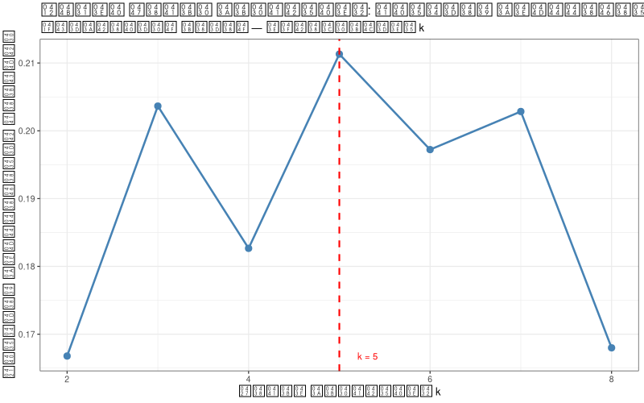
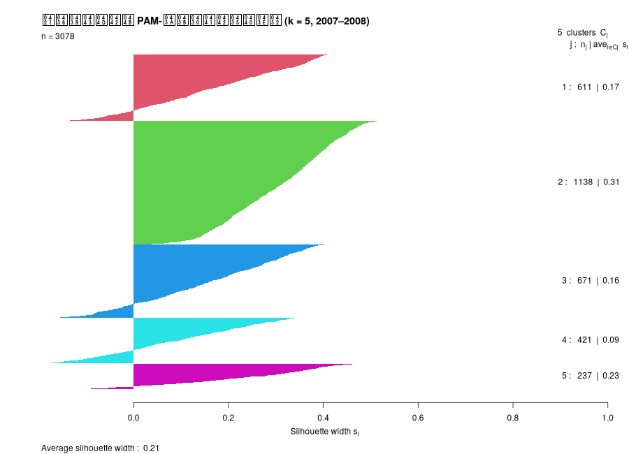
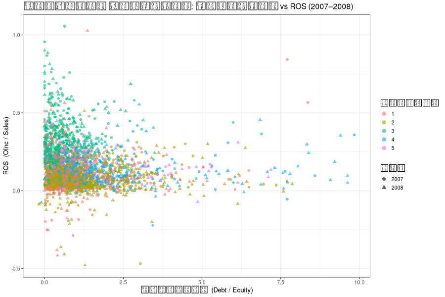
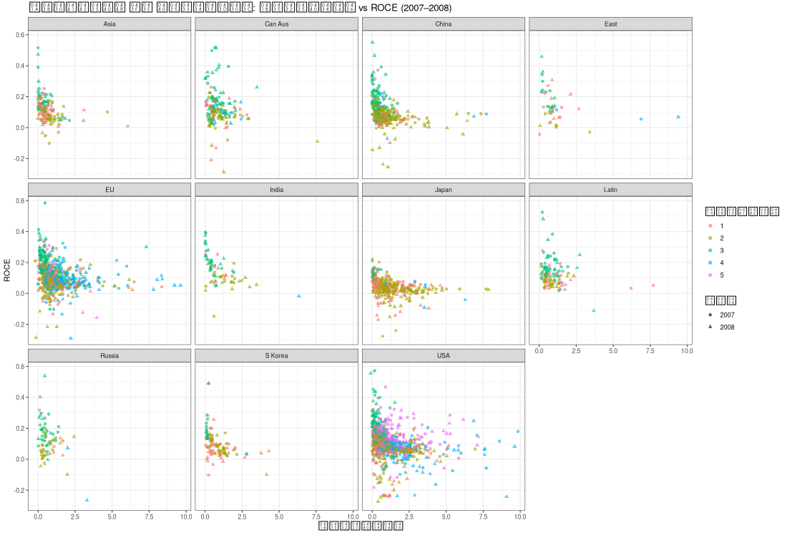
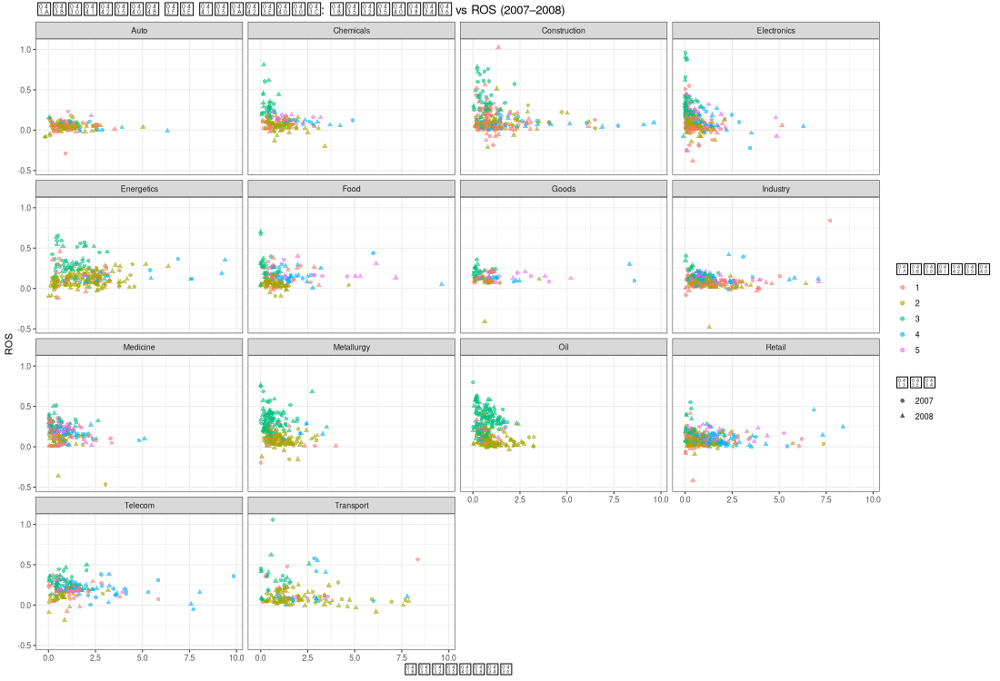
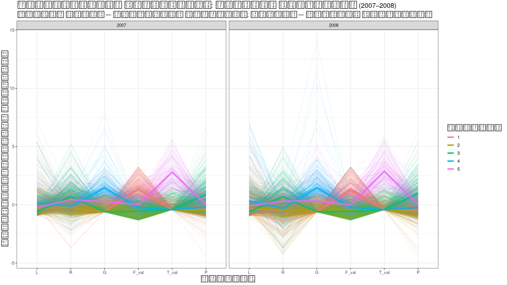
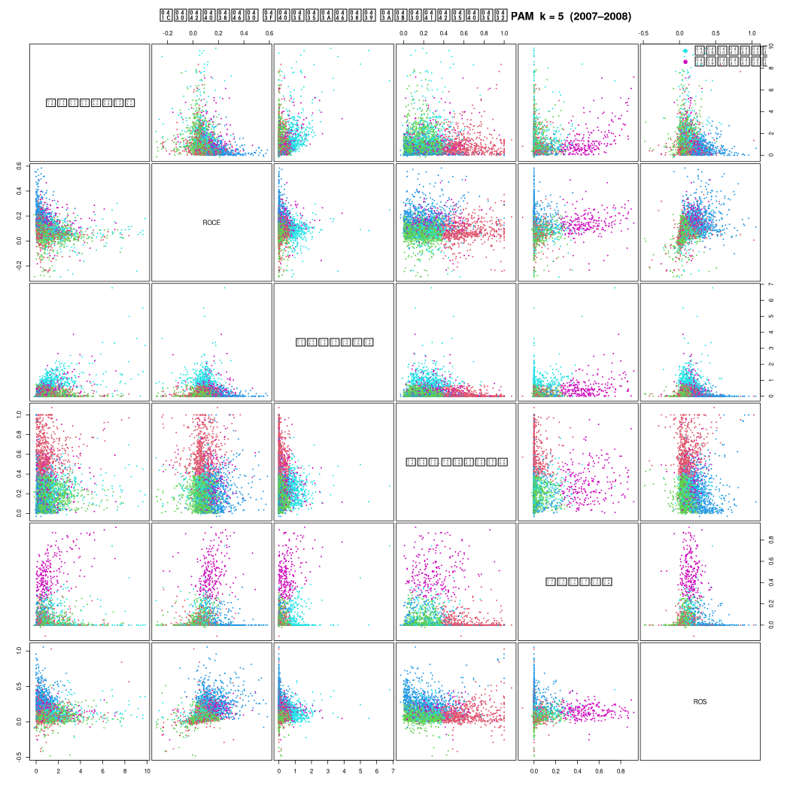

# Лабораторная работа 6 — Кластерный анализ корпоративной отчётности

**Данные:** 22 финансовых показателя по 1 717 компаниям, годы **2007 и 2008**  
**Метод:** PAM (Partitioning Around Medoids), оптимальное k выбирается по силуэту  
**Скрипт:** [`lab_06.R`](lab_06.R)

---

## Консольный вывод

После загрузки 12 CSV-файлов (1 717 строк в каждом) скрипт формирует 6 финансовых коэффициентов (Леверидж, ROCE, Гудвилл, Фин.Активы, Байбек, ROS), объединяет два года и удаляет наблюдения с NA/Inf и выбросами. Итоговая выборка — **3 078 наблюдений** (1 547 за 2007 г. и 1 531 за 2008 г.).

Перебор k от 2 до 8 даёт следующие средние значения силуэта:

| k | 2 | 3 | 4 | **5** | 6 | 7 | 8 |
|---|---|---|---|---|---|---|---|
| avg sil | 0.167 | 0.204 | 0.183 | **0.211** | 0.197 | 0.203 | 0.168 |

Максимум при **k = 5** — выбрано как оптимальное число кластеров.

Распределение компаний по кластерам: **611 / 1138 / 671 / 421 / 237**.

Медианные профили кластеров показывают осмысленное разделение:
- **Кластер 3** — высокое ROCE (0.16) и ROS (0.27): прибыльные компании с низким долгом
- **Кластер 4** — высокий Гудвилл (0.95): компании с крупными M&A
- **Кластер 5** — значимая доля байбека (0.47): активный возврат капитала акционерам
- **Кластер 2** — наибольший размер (1138): «типичные» умеренно-задолженные компании
- **Кластер 1** — умеренный леверидж с долей финансовых активов выше средней

---

## Графический вывод

### 01 — Выбор числа кластеров (силуэт)

Линейный график среднего коэффициента силуэта для k = 2…8. Красная пунктирная линия отмечает оптимум при **k = 5** (avg. sil = 0.211). Хорошо видно, что k = 4 даёт провал, а k = 5 — глобальный максимум.

---

### 02 — Силуэтный график итоговой кластеризации

Горизонтальные полосы показывают индивидуальные силуэты для каждой из 3 078 компаний, сгруппированные по 5 кластерам (разные цвета). Средний силуэт = **0.21**. Кластер 2 (зелёный, 1138 компаний) имеет наилучшее разделение (avg = 0.31); кластер 4 (голубой, 421 компания) — наиболее «размытый» (avg = 0.09), что указывает на его неоднородность.

---

### 03 — Рассеяние: Леверидж vs ROS

Основная масса наблюдений сосредоточена при леверидже 0–2.5 и ROS 0–0.3; кластеры 4 (синие, высокий гудвилл) и 5 (розовые, байбек) выделяются по оси ROS. Точки (2007) и треугольники (2008) перемешаны равномерно — кластерная структура стабильна между годами.

---

### 04 — Рассеяние по регионам: Леверидж vs ROCE

Фасетирование по 11 регионам: США содержат наибольшее число компаний всех кластеров; Япония концентрируется вблизи низкого ROCE (кластер 2 доминирует). Россия и Латинская Америка малочисленны, но кластеры 1 и 2 там присутствуют.

---

### 05 — Рассеяние по секторам: Леверидж vs ROS

В секторах **Energetics** и **Oil** кластер 3 (высокий ROS, зелёный) занимает верхнюю часть — ресурсные компании в 2007–2008 гг. были высокоприбыльны. В **Transport** и **Retail** преобладает кластер 2 с умеренным левериджем и низкой ROS. Сектор **Medicine** содержит много наблюдений кластеров 4 и 5 (компании с гудвиллом/байбеком).

---

### 06 — Параллельные координаты

Два панели (2007 / 2008): тонкие линии — отдельные компании, жирные — медиана кластера. Профили кластеров воспроизводятся одинаково в оба года, что подтверждает устойчивость разбиения. Кластер 5 (сиреневый) имеет резкий пик на признаке **T_val** (байбек), кластер 4 (синий) — на **G** (гудвилл).

---

### 07 — Матрица рассеяния (все пары признаков)

Матрица 6×6 показывает проекции на все попарные плоскости признаков. Наиболее чёткое разделение достигается в плоскостях с участием **G (Гудвилл)** и **T_val (Байбек)**: кластеры 4 и 5 визуально обособлены. В плоскостях L–R и L–P кластеры перекрываются, что соответствует умеренному значению силуэта (~0.21).

---

## Теоретические сведения

### Что такое кластерный анализ

Кластерный анализ — это метод многомерной статистики и машинного обучения без учителя, предназначенный для разбиения объектов на **группы (кластеры)** так, чтобы объекты внутри одного кластера были максимально похожи друг на друга, а объекты из разных кластеров — максимально различались. В отличие от классификации, при кластеризации заранее неизвестны правильные метки классов: структура данных выявляется непосредственно по значениям признаков.

В контексте корпоративной отчётности кластеризация позволяет выделять типовые профили компаний: например, устойчиво прибыльные фирмы, компании с высоким уровнем долговой нагрузки, фирмы с крупным гудвиллом после сделок M&A или компании, активно возвращающие капитал акционерам через buyback. Такое разбиение полезно для финансового анализа, сегментации эмитентов и поиска скрытых закономерностей в структуре показателей.

### Пространство признаков и расстояния

Каждая компания в задаче представляется точкой в многомерном пространстве признаков. Если для анализа выбраны 6 финансовых коэффициентов, то каждая строка данных интерпретируется как точка в шестимерном пространстве. Основная идея кластеризации состоит в сравнении расстояний между такими точками: близкие точки считаются похожими по финансовому профилю, а удалённые — различными.

На практике качество кластеризации существенно зависит от подготовки признаков. Финансовые показатели могут иметь разные масштабы, тяжёлые хвосты распределения и выбросы, поэтому перед кластеризацией часто выполняют:

- очистку пропусков и некорректных значений;
- удаление или ослабление влияния выбросов;
- нормализацию/стандартизацию признаков;
- переход от абсолютных величин к относительным коэффициентам.

Использование коэффициентов вместо абсолютных показателей особенно важно для корпоративной отчётности, поскольку компании различаются по масштабу бизнеса, и без нормировки размер фирмы может доминировать над экономическим содержанием остальных признаков.

### Метод PAM (Partitioning Around Medoids)

В работе используется алгоритм **PAM** — Partitioning Around Medoids. Он относится к методам разбиения, как и k-means, однако вместо центроидов использует **медоиды**. Медоид — это реальный объект выборки, который является наиболее «центральным» представителем своего кластера, то есть минимизирует суммарное расстояние до остальных объектов внутри группы.

Основные идеи PAM:

1. выбирается число кластеров k;
2. среди наблюдений подбираются k медоидов;
3. каждый объект относится к ближайшему медоиду;
4. далее медоиды итеративно уточняются так, чтобы уменьшить суммарную внутрикластерную неоднородность.

Преимущества PAM по сравнению с k-means:

- устойчивость к выбросам, поскольку центр кластера всегда является реальным наблюдением;
- возможность применять произвольные меры расстояния;
- более интерпретируемые «представители» кластеров.

Для финансовых данных это особенно удобно, так как распределения коэффициентов часто не являются нормальными, а отдельные компании могут иметь экстремальные значения.

### Выбор числа кластеров

Одной из ключевых задач кластерного анализа является выбор числа кластеров **k**. Если кластеров слишком мало, различающиеся типы компаний будут искусственно объединены; если слишком много — модель начнёт дробить естественные группы на мелкие и слабо интерпретируемые подмножества.

В данной лабораторной работе число кластеров определяется по **среднему коэффициенту силуэта**. Для каждого наблюдения вычисляется значение:

\[
s(i) = \frac{b(i) - a(i)}{\max(a(i), b(i))}
\]

где:

- \(a(i)\) — среднее расстояние от объекта до остальных объектов своего кластера;
- \(b(i)\) — минимальное среднее расстояние до объектов ближайшего соседнего кластера.

Интерпретация силуэта:

- **s(i) близко к 1** — объект хорошо соответствует своему кластеру;
- **s(i) около 0** — объект находится на границе между кластерами;
- **s(i) < 0** — объект, вероятно, отнесён не к тому кластеру.

Среднее значение силуэта по всей выборке служит формальным критерием качества разбиения. Чем оно выше, тем лучше одновременно достигаются компактность кластеров и их разделимость.

### Визуальная интерпретация кластеров

Формального критерия недостаточно для полноценного анализа, поэтому кластеризацию обычно дополняют визуальными методами. В лабораторной работе используются:

- силуэтные диаграммы;
- диаграммы рассеяния по парам признаков;
- фасетированные графики по регионам и секторам;
- параллельные координаты;
- матрица попарных проекций.

Такие представления позволяют оценить, какие именно признаки сильнее всего разделяют компании, насколько устойчиво разбиение между годами и существуют ли содержательно интерпретируемые типы фирм. Если кластер можно описать через экономический смысл (например, «высокий ROCE и низкий долг» или «высокий гудвилл после поглощений»), то результат кластеризации становится не только статистически, но и practically useful для прикладного финансового анализа.

### Экономический смысл кластеризации компаний

Для корпоративной отчётности кластерный анализ удобен тем, что позволяет перейти от набора разрозненных коэффициентов к типологии компаний. Вместо анализа каждого признака по отдельности исследователь получает группы с близкими стратегиями финансирования, рентабельности и структуры активов. Это помогает:

- сравнивать компании не по одному показателю, а по целому профилю;
- искать атипичные фирмы и потенциальные выбросы;
- анализировать устойчивость финансовых моделей по годам;
- выделять сегменты для дальнейшего инвестиционного или отраслевого исследования.

Таким образом, кластерный анализ в данной лабораторной работе выступает как инструмент структурирования сложных многомерных данных корпоративной отчётности и выявления скрытых экономических типов компаний на основе их финансовых коэффициентов.
